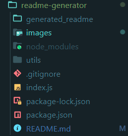
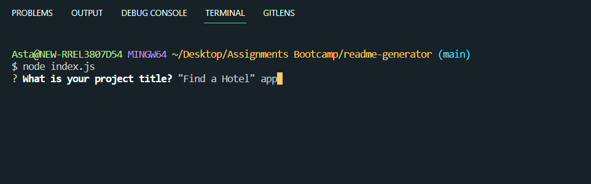
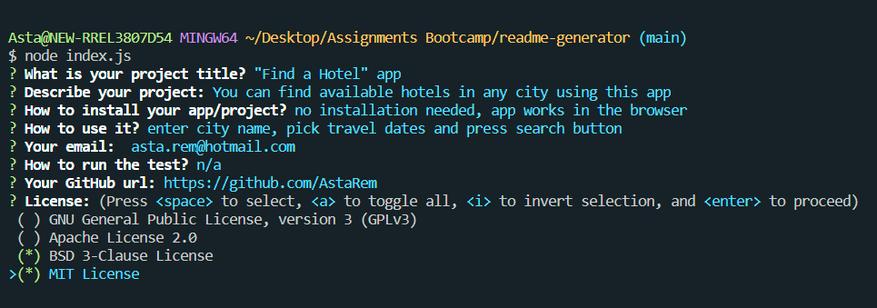
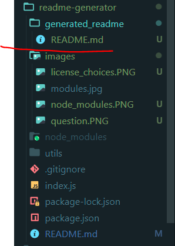
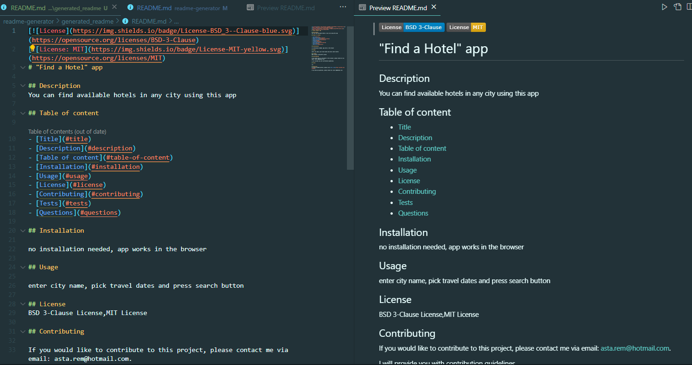

# README.md file generator

## Description

Every project on Github requires quality README file. 
I have created this Node.js application to generate README file from user input. 
This way user can get completed README file in seconds and no sections will be forgotten. 

App runs in terminal.

## Languages/libraries/technologies used
- Javascript
- Node.js
- Inquirer npm package

## Installation

To view this project you need to install Node.js on your local machine. 
Please copy/clone/download this repository to your local machine and install all dependencies.

## Usage

Here is a [walkthrough video]() which shows the functionality of the application.

Once you installed dependencies, you will see node_modules folder in your repository:

Now open terminal window in the repository. Run `node index.js`.

In the terminal you will see questions displayed. Answer question, press enter. The next question will be displayed. Answer all questions one by one. 

Last question will multiple choice question with multiple options. You can select more that one. 

Once all questions are answered, press Enter - the new README.md file is created and placed into the "generated_readme" folder.

Contents of the new file:

When user clicks on the links in the 'Table of contents', they are taken to relevant section.

If you will run the program again, the new file will be created and previous information will be overwritten.

## Tests

n/a